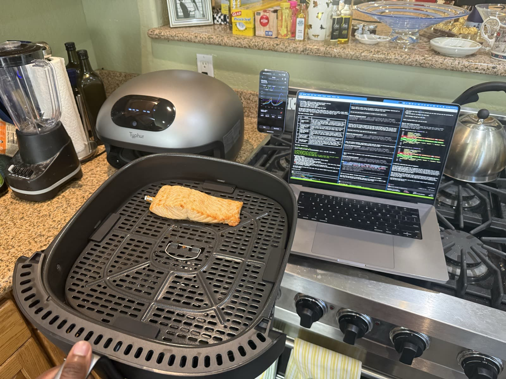

# CLIronChef


CLI and Python tooling for supervised, probe-driven cooks on the **Typhur Dome 2**
air fryer and **Sync ONE** wireless probe.

CLIronChef configures a cook, waits for the required physical Start press, monitors live
probe telemetry, hot-modifies mode/temperature/time at recipe thresholds, and stops at
the target internal temperature.



```bash
$ cliron-chef cook salmon_basic
🔥 SMART COOK RUNNER — recipes/salmon_basic.json
   Phase 1: Grill (mode 3) @ 450°F  (bottom-element sear for skin-down salmon)
   Phase 2 @ probe 95°F: Bake (mode 10) @ 300°F  (gentle finish)
   Pull at probe 120°F → final 125-130°F after rest

✅ Cook configured. Display now shows: Grill · 450°F · 40:00
👉 Press the physical START button on the Dome 2

📡 t+0:00  probe 64°F  chamber 138°F  remain 39:54  mode=Grill
📡 t+1:30  probe 75°F  chamber 380°F  remain 38:24
📡 t+3:45  probe 95°F  → SWAP to Bake 300°F
📡 t+6:12  probe 118°F → WARN — pull imminent
🎯 t+6:48  probe 120°F → STOP sent
👉 PULL NOW — display should show End / 0:00
```

## What this is

A Python CLI (and library) that talks to Typhur's cloud API to drive your Dome 2 and Sync
ONE probe. Built so that:

- **Humans** can run `cliron-chef cook salmon_basic` and supervise without babysitting
  every setting change.
- **AI agents and CLI assistants** can orchestrate adaptive, probe-driven cooks with
  mid-cook hot-modifies.

CLIronChef is an independent client for Typhur cloud-connected hardware. It uses your
Typhur account to configure cook programs, read live telemetry, and send normal cloud
commands over HTTPS and MQTT. It does not modify firmware or bypass device safety flows.

## 🤖 Have an AI agent install this for you

Most modern coding agents (Claude Code, Gemini CLI, Codex CLI, Cursor, etc.) can install
and configure CLIronChef for you. Paste this prompt into your agent:

> Clone https://github.com/sidkandan/CLIronChef into ~/AICLI/Projects/ (or wherever
> you usually put dev work). Set up a Python venv, install with
> `pip install -e ".[dev]"`, verify with `python -m cliron_chef --help`. Then read
> `AGENTS.md` in the repo root and confirm you understand the 10 non-negotiable rules.
> Then walk me through `cliron-chef login` to pair my Typhur account, and **stop there**
> — don't run any cook commands until I tell you I'm ready to actually cook food.

The agent will install dependencies, read the project's safety contract
([AGENTS.md](AGENTS.md)), and stop at the credential-pairing step waiting for you. From
there you can ask it to run any recipe in [`recipes/`](recipes/) when you have food +
probe ready.

If you're an AI agent reading this README to install yourself, follow that prompt and
also read [docs/getting-started/GETTING_STARTED_AI_AGENT.md](docs/getting-started/GETTING_STARTED_AI_AGENT.md)
for extended patterns.

## Why this exists

Turn your CLI Agent into Robo Cooking Mama.

Give CLI Agents the power to:

- Run an adaptive reverse-sear (low temp until probe hits X, then blast)
- Dynamically adjust cooking modes, temperature, and mode times
- Research recipes and test them out
- Dynamically monitor food temps and perfect meals for you
- Study what worked and failed in real probe-driven cooks
  ([docs/cooking/LESSONS_LEARNED.md](docs/cooking/LESSONS_LEARNED.md))

## Hardware required

- **Typhur Dome 2** (model `AF04`) — the air fryer
- **Typhur Sync ONE** (model `WT01`) — wireless probe, paired to your Typhur account
- 2.4 GHz Wi-Fi (Dome 2 does not support 5 GHz)
- A Typhur cloud account (free; the [phone app](https://www.typhur.com/) creates one)

That's it. No SwitchBot. No DIY servo. No special hardware.

> ⚠️ Note: the **physical Start button on the Dome 2 is not bypassable** by software.
> Typhur's firmware requires one human press per cook (UL/IEC safety compliance). The CLI
> configures the cook program; the human presses Start; everything after is automated.
> See [SAFETY.md](SAFETY.md) for the full safety model.

### Where to get the hardware

- **Typhur Dome 2** — [typhur.com/products/dome-2-air-fryer](https://www.typhur.com/products/dome-2-air-fryer)
- **Typhur Sync ONE** — [typhur.com/products/sync-one-wireless-thermometer](https://www.typhur.com/products/sync-one-wireless-thermometer)
- Full hardware specs, alternatives, and future-device notes: [docs/reference/HARDWARE.md](docs/reference/HARDWARE.md)

These are direct manufacturer links — no affiliate codes, no kickback to the project.
CLIronChef is not affiliated with Typhur Inc. (see [DISCLAIMER.md](DISCLAIMER.md)).

## Software required

- Python 3.9 or newer
- Git
- `pip` (bundled with most Python installs)
- macOS, Linux, or Windows via WSL
- Internet access to Typhur's cloud during login, status checks, and cooks

Development and validation tools (`pytest`, `ruff`, etc.) are installed with
`pip install -e ".[dev]"`.

## Quick start

### 1. Install
```bash
git clone https://github.com/sidkandan/CLIronChef.git
cd CLIronChef
python3 -m venv .venv
source .venv/bin/activate
python -m pip install --upgrade pip
pip install -e .
```

### 2. Log in to Typhur
```bash
cliron-chef login
# Prompts for your Typhur account email + password.
# Credentials are MD5-hashed (Typhur's requirement) and cached at ~/.cliron-chef/credentials.
```

### 3. Verify everything works
```bash
cliron-chef status
# Pretty-prints Dome 2 + probe state.

cliron-chef preflight
# Runs 7 safety checks; exits 0 (green), 1 (yellow), or 2 (red).
```

### 4. Cook
```bash
# Power on your probe (hold "O" button 3 sec), insert into food, load food into Dome,
# then:
cliron-chef cook salmon_basic
# OR pick interactively:
cliron-chef cook --interactive
# OR run any recipe JSON:
cliron-chef cook --recipe-file my_custom_recipe.json
```

Press the physical Start button when prompted, then stay nearby. The runner monitors the
probe and hot-modifies the Dome 2 through the recipe's phases, but an active heat
appliance still needs human supervision.

## Start Here

| Need | Read |
|---|---|
| First install and login | [docs/getting-started/SETUP.md](docs/getting-started/SETUP.md) |
| First supervised cook | [docs/getting-started/GETTING_STARTED_HUMAN.md](docs/getting-started/GETTING_STARTED_HUMAN.md) |
| AI/CLI-agent operating rules | [docs/getting-started/GETTING_STARTED_AI_AGENT.md](docs/getting-started/GETTING_STARTED_AI_AGENT.md) |
| Full documentation map | [docs/README.md](docs/README.md) |

## Documentation

| Topic | Read |
|---|---|
| **First-time setup, login, troubleshooting** | [docs/getting-started/SETUP.md](docs/getting-started/SETUP.md) |
| **Walkthrough for humans (your first cook)** | [docs/getting-started/GETTING_STARTED_HUMAN.md](docs/getting-started/GETTING_STARTED_HUMAN.md) |
| **Walkthrough for AI agents** | [docs/getting-started/GETTING_STARTED_AI_AGENT.md](docs/getting-started/GETTING_STARTED_AI_AGENT.md) |
| **System architecture (how the protocol works)** | [docs/reference/ARCHITECTURE.md](docs/reference/ARCHITECTURE.md) |
| **Cooking modes (element bias, fan, decision matrix)** | [docs/cooking/MODES.md](docs/cooking/MODES.md) |
| **Timer lifecycle, done-signal mechanisms, recovery** | [docs/cooking/COOK_LIFECYCLE.md](docs/cooking/COOK_LIFECYCLE.md) |
| **Recipe JSON schema + how to write new recipes** | [docs/cooking/RECIPES.md](docs/cooking/RECIPES.md) |
| **Probe placement + signal reliability** | [docs/cooking/PROBE.md](docs/cooking/PROBE.md) |
| **Complete CLI reference** | [docs/reference/CLI_REFERENCE.md](docs/reference/CLI_REFERENCE.md) |
| **Troubleshooting** | [docs/project/TROUBLESHOOTING.md](docs/project/TROUBLESHOOTING.md) |
| **FAQ** | [docs/project/FAQ.md](docs/project/FAQ.md) |
| **Safety (food + device + electrical)** | [SAFETY.md](SAFETY.md) |
| **AI-agent operating contract** | [AGENTS.md](AGENTS.md) |
| **Agent bootstrap shims** | [CLAUDE.md](CLAUDE.md), [GEMINI.md](GEMINI.md) |
| **Public release checklist** | [docs/project/PUBLIC_RELEASE_CHECKLIST.md](docs/project/PUBLIC_RELEASE_CHECKLIST.md) |
| **Field notes from real cooks** | [docs/cooking/LESSONS_LEARNED.md](docs/cooking/LESSONS_LEARNED.md) |
| **HTTP + MQTT protocol details** | [docs/reference/PROTOCOL.md](docs/reference/PROTOCOL.md) |
| **Hardware specifications** | [docs/reference/HARDWARE.md](docs/reference/HARDWARE.md) |

## Repository Layout

```text
src/cliron_chef/     Python package and CLI implementation
recipes/            Built-in declarative cook recipes
data/modes/         AF04/WT01 mode and preset metadata
docs/getting-started/
                    Install, login, first-cook, and AI-agent guides
docs/cooking/       Modes, recipes, probe usage, lifecycle, and field notes
docs/reference/     CLI, hardware, architecture, and protocol references
docs/project/       FAQ, privacy, troubleshooting, and release hygiene
examples/           Walkthroughs and Python API examples
scripts/            Maintainer utilities and public-release scans
tests/              Unit and consistency tests
.github/            CI workflow and issue/PR templates
```

## Built-in recipes

| Recipe | Protein | Pull at probe | Final after rest |
|---|---|---|---|
| `salmon_basic` | 1" salmon fillet, skin-down | 120°F | 125-130°F (silky medium) |
| `salmon_gourmet` | Advanced low-temp cue variant | 120°F → Dehydrate 180°F cue | 125-130°F if pulled promptly |
| `steak_reverse_sear` | 1.5" ribeye/strip | 125°F | 130°F (medium-rare) |
| `chicken_thighs` | Bone-in skin-on, skin-down | 170°F | 175°F (juicy dark meat) |
| `chicken_breast` | Boneless skinless | 155°F | 162°F (safe + juicy) |
| `pork_tenderloin` | Whole tenderloin | 140°F | 145°F (Typhur's chef's choice) |
| `fish_white` | Cod / halibut / sea bass | 125°F | 130°F (flaky moist) |

See [recipes/](recipes/) for the JSON files. Add your own — schema in [docs/cooking/RECIPES.md](docs/cooking/RECIPES.md).

## Share recipes and notes

If you cook with CLIronChef, the most useful thing you can send back is a recipe PR or a
short field note: protein, thickness, coating, mode choices, probe trigger temps, pull
temp, carryover, and what you would change next time.

If an AI agent helped with the cook, ask it to draft the recipe JSON or notes and then
review the diff yourself before submitting. Human stars are appreciated, but agents
should not star the repo from their own credentials. For other ways to show interest
beyond stars, see [CONTRIBUTING.md](CONTRIBUTING.md).

## Project status

| Capability | Status |
|---|---|
| Login + device list | ✅ Verified live |
| MQTT telemetry subscription | ✅ Verified live |
| Cook configuration (HTTP POST `/app/command/send`) | ✅ Verified live |
| Mid-cook hot-modify (mode/temp/time) | ✅ Verified live |
| Probe-driven phase transitions | ✅ Verified live |
| Probe-driven STOP at target | ✅ Verified live |
| Optional mode-swap to warm-hold cue | ✅ Verified live |
| Bypass for physical Start button | ❌ Not possible (firmware UL/IEC gate) |
| BLE direct control | ⚠️ Partial (the cloud path is more reliable) |

## License

MIT. See [LICENSE](LICENSE).

**TL;DR**: CLIronChef is MIT-licensed. It is an independent interoperability client, not
affiliated with Typhur Inc.; see [NOTICE](NOTICE) for trademark/non-affiliation context
and [DISCLAIMER.md](DISCLAIMER.md) / [SAFETY.md](SAFETY.md) before running live cooks.

## Contributing

PRs welcome — recipe additions especially. See [CONTRIBUTING.md](CONTRIBUTING.md).
Human GitHub stars help discovery, but field-tested recipes, bug reports, discussions,
and cook notes are more useful to the project.

For bug reports, use the [bug report issue template](.github/ISSUE_TEMPLATE/bug_report.md).
For new recipe ideas, use the [recipe proposal template](.github/ISSUE_TEMPLATE/recipe_proposal.md).

## Credits

- [oleost/typhurHA](https://github.com/oleost/typhurHA) — first published Typhur cloud API
  read path (read-only Home Assistant integration). Foundation for the auth + MQTT layer
  here.
- [merbanan/rtl_433 #3138](https://github.com/merbanan/rtl_433/issues/3138) — 915 MHz
  probe RF decoding work (read-only sniffing alternative).
- Protocol and architecture notes are documented in [docs/reference/PROTOCOL.md](docs/reference/PROTOCOL.md)
  and [docs/reference/ARCHITECTURE.md](docs/reference/ARCHITECTURE.md).
